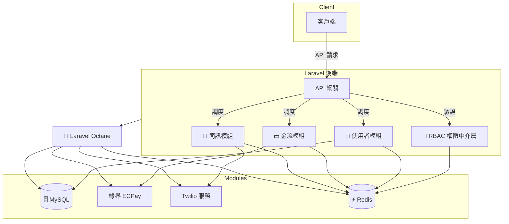

# ModuCore

**Plug. Secure. Scale.**  
企業級模組化後端框架，基於 Laravel 打造，專為高效能、可擴展的 API 系統設計。  

[](https://laravel.com)
[](https://www.php.net)
[](https://github.com/BpsEason/ModuCore/actions)

**技術標籤**：`Laravel` `Octane` `Docker` `RBAC` `Swagger` `CI/CD`

ModuCore 是一個模組化、高效能的 Laravel 後端框架，專為中大型 API 平台、SaaS 後台或多租戶系統設計。本倉庫提供核心模組代碼（User、Payment、Sms、Rbac），需整合至新建的 Laravel 專案，幫助開發者快速構建可擴展的 API 系統。核心功能包括：

- ⚙️ **模組化架構**：獨立模組（User、Payment、Sms、Rbac），支援 `make:module` 指令快速生成。
- 🔐 **RBAC 權限控管**：角色與權限分離，確保安全存取。
- 🚀 **高效能**：整合 Laravel Octane 和 Redis，應對大量請求。
- 📦 **CI/CD 自動化**：GitHub Actions 實現測試、構建和部署。
- 📘 **API 文件**：自動生成 Swagger/OpenAPI 文件，簡化測試與協作。

🧱 **適用情境**：
- 快速搭建企業級 API 或 SaaS 平台。
- 需要模組化和權限管理的 Laravel 團隊。
- 追求高效能和自動化部署的開發者。

---

## Why ModuCore?

當專案規模擴大時，Laravel 應用常面臨模組耦合、權限管理複雜和性能瓶頸等問題。ModuCore 透過模組化設計、RBAC 權限控管和高效能技術（Octane、Redis），讓開發者專注於業務邏輯，快速交付穩定的 API 系統。我們的目標是打造一個開箱即用的框架，兼顧靈活性和企業級穩定性，讓團隊高效開發並簡化部署流程。😎

## ✨ 特性與亮點

| 特性                       | 說明                                                                 |
|----------------------------|----------------------------------------------------------------------|
| 🧱 模組化架構               | 所有功能以模組方式封裝，可獨立開發、註冊與移除，支援 `make:module` 自動生成骨架。 |
| 🔐 進階 RBAC 控制            | 角色與權限完全解耦，結合 Redis 快取、API Key 驗證與速率限制，確保系統安全。     |
| ⚡ Laravel Octane 整合       | 使用 Swoole 提升吞吐量與低延遲，支援高併發 API 請求場景。                        |
| 🚀 容器化部署               | 完整 Docker 化支援，含 db/redis/backend 多服務，便於跨環境部署與 CI/CD 串接。    |
| 📄 自動化 API 文件產生       | 整合 Swagger/OpenAPI，自動生成端點與參數說明，便於開發與測試。                  |
| 🔌 可插拔服務整合            | 金流（ECPay）、簡訊（Twilio）皆以策略模式封裝，輕鬆擴充或更換供應商。            |
| 🧪 模組化測試覆蓋            | 每個模組皆內建 Feature 測試，支援自動化測試與資料填充。                        |

---

## 專案結構

本倉庫提供核心模組代碼，需整合到新建的 Laravel 專案。整合後的結構如下：

```
laravel-project/
├── app/
│   ├── Console/Commands/         # 自定義 Artisan 命令（make:module）
│   ├── Core/Models/             # RBAC 模型（Role、Permission、UserRole）
│   ├── Http/Middleware/         # 中介層（API Key、權限檢查、速率限制）
│   ├── Modules/                 # 模組化結構
│   │   ├── User/                # 使用者模組
│   │   ├── Payment/             # 金流模組（ECPay）
│   │   ├── Sms/                 # 簡訊模組（Twilio）
│   │   └── Rbac/                # 角色權限管理模組
├── config/                      # 配置檔案（modules.php、octane.php）
├── database/                    # 資料庫遷移和填充
├── tests/                       # 測試檔案
├── .env.example                 # 環境變數範例
├── composer.json                # PHP 依賴配置
├── .github/workflows/           # CI/CD 配置（deploy.yml）
└── docker/                      # Docker 配置（可選）
```

### 架構圖
以下是 ModuCore 的模組化架構，強調數據流與模組解耦：



📌 **說明亮點**：
- 模組化區塊以邏輯區分，便於擴充與維護。
- 明確標註高效能執行路徑（Octane ⟶ Redis/MySQL）。
- 整合外部服務（綠界 ECPay, Twilio）清楚標示與責任邊界。

---

## 環境要求

- **PHP**：8.2 或以上。
- **Composer**：用於安裝 Laravel 和依賴。
- **Docker**（可選）：用於容器化部署。
- **Git**：版本控制與 CI/CD。
- **網際網路連線**：拉取依賴和 Docker 映像（若使用）。

---

## 安裝步驟

本倉庫僅包含核心模組代碼，需整合至新建的 Laravel 專案。以下是快速上手步驟：

1. **初始化 Laravel 專案**：
   ```bash
   composer create-project laravel/laravel laravel-project
   cd laravel-project
   ```

2. **克隆 ModuCore 並整合**：
   ```bash
   git clone https://github.com/BpsEason/ModuCore.git
   cp -r ModuCore/app ./
   cp -r ModuCore/config ./
   cp -r ModuCore/database ./
   cp -r ModuCore/tests ./
   cp -r ModuCore/.github ./
   cp ModuCore/.env.example ./
   ```
   - 複製核心代碼（模組、RBAC、中介層等）。
   - 若包含 `docker/`，可選擇複製：
     ```bash
     cp -r ModuCore/docker ./
     cp ModuCore/docker-compose.yml ./
     cp ModuCore/docker-compose.prod.yml ./
     ```

3. **更新 composer.json**：
   將以下依賴加入 `composer.json` 的 `require`：
   ```json
   {
       "require": {
           "laravel/octane": "^2.0",
           "laravel/sanctum": "^3.0",
           "l5-swagger": "^8.0",
           "predis/predis": "^2.0",
           "twilio/sdk": "^7.0"
       }
   }
   ```
   執行：
   ```bash
   composer update
   ```

4. **配置環境變數**：
   ```bash
   cp .env.example .env
   ```
   設置關鍵變數：
   - `APP_KEY`：執行 `php artisan key:generate`。
   - `MODUCORE_API_KEY`：API 認證密鑰。
   - `ECPAY_*`：ECPay 憑證（`MERCHANT_ID`, `HASH_KEY`, `HASH_IV`）。
   - `TWILIO_*`：Twilio 憑證（`ACCOUNT_SID`, `AUTH_TOKEN`, `FROM_PHONE_NUMBER`）。
   - `DB_*`：資料庫配置（預設 MySQL）。
   - `REDIS_*`：Redis 配置（若使用）。

5. **執行資料庫遷移和填充**：
   ```bash
   php artisan migrate --seed
   ```

6. **配置 Laravel Octane**：
   ```bash
   php artisan octane:install --server=swoole
   ```

7. **生成 Swagger 文件**：
   ```bash
   php artisan vendor:publish --provider="L5Swagger\L5SwaggerServiceProvider"
   php artisan l5-swagger:generate
   ```

8. **啟動應用程式**：
   - 使用 Laravel 內建伺服器：
     ```bash
     php artisan serve
     ```
   - 或使用 Docker（若複製了 Docker 配置）：
     ```bash
     docker-compose up --build -d
     ```
   - 訪問：
     - 後端服務：`http://localhost:8000`
     - Swagger API 文件：`http://localhost:8000/api/documentation`

---

## 使用方式

### API 端點
所有 API 需提供：
- **API Key**：請求頭 `X-API-KEY`（來自 `.env` 的 `MODUCORE_API_KEY`）。
- **Sanctum 認證**：部分端點需 Bearer Token（透過 `/api/auth/login` 獲取）。
- **權限檢查**：RBAC 控制存取（需分配角色/權限）。

主要端點：
- **User**：`/api/users`（CRUD 操作）
- **Payment**：`/api/payments`（ECPay 金流）
- **Sms**：`/api/sms/send`, `/api/sms/{externalId}/status`, `/api/sms/send-verification`（Twilio 簡訊）
- **Rbac**：`/api/rbac/roles`, `/api/rbac/permissions`（角色與權限管理）

詳細文件：`http://localhost:8000/api/documentation`

### 快速 API 測試
使用 Postman 測試簡訊發送：
```json
{
    "url": "http://localhost:8000/api/sms/send",
    "method": "POST",
    "headers": {
        "X-API-KEY": "{{MODUCORE_API_KEY}}",
        "Authorization": "Bearer {{YOUR_TOKEN}}",
        "Accept": "application/json"
    },
    "body": {
        "phone_number": "+886912345678",
        "message": "Hello, this is a test SMS!"
    }
}
```
[Swagger UI 截圖：展示 API 文件介面]

### 生成新模組
```bash
php artisan make:module YourNewModule --all
```
生成模組位於 `app/Modules/YourNewModule`，包含控制器、服務、模型、路由等。

### 壓力測試
若包含 `tests/load_test.sh`，執行：
```bash
cd tests
./load_test.sh
```

---

## 模組化設計範例

以下展示關鍵代碼，包含詳細註解，幫助開發者快速上手。

### 1. 自定義 Artisan 命令：MakeModule.php
用於生成模組骨架。

```php
<?php
namespace App\Console\Commands;

use Illuminate\Console\Command;
use Illuminate\Support\Str;

class MakeModule extends Command
{
    protected $signature = 'make:module {name} {--all} {--controller} {--service} {--model} {--routes} {--contract} {--provider} {--migration} {--config} {--test}';
    protected $description = 'Create a new module with specified components';

    public function handle()
    {
        $name = $this->argument('name');
        $modulePath = app_path('Modules/' . $name);

        // 檢查模組是否已存在，避免覆蓋
        if (is_dir($modulePath) && !$this->confirm("Module {$name} already exists. Overwrite?", false)) {
            $this->error("Module creation aborted.");
            return;
        }

        // 創建模組目錄結構
        $this->createModuleStructure($name);

        // 根據選項生成指定組件
        if ($this->option('all') || $this->option('controller')) $this->createController($name);
        if ($this->option('all') || $this->option('service')) $this->createService($name);
        if ($this->option('all') || $this->option('model')) $this->createModel($name);
        if ($this->option('all') || $this->option('routes')) $this->createRoutes($name);
        if ($this->option('all') || $this->option('contract')) $this->createContract($name);
        if ($this->option('all') || $this->option('provider')) $this->createProvider($name);
        if ($this->option('all') || $this->option('migration')) $this->createMigration($name);
        if ($this->option('all') || $this->option('config')) $this->createConfig($name);
        if ($this->option('all') || $this->option('test')) $this->createTest($name);

        $this->info("Module {$name} created successfully at {$modulePath}");
    }

    // 創建模組目錄結構（Controllers、Services、Models 等）
    protected function createModuleStructure($name)
    {
        $dirs = ['Controllers', 'Services', 'Contracts', 'Models', 'Providers', 'Config'];
        foreach ($dirs as $dir) {
            mkdir(app_path('Modules/' . $name . '/' . $dir), 0755, true);
        }
    }

    // 生成控制器，使用 stub 模板並替換命名空間和類名
    protected function createController($name)
    {
        $stub = file_get_contents(base_path('stubs/module.controller.stub'));
        $stub = str_replace(['{{module}}', '{{class}}'], [$name, Str::studly($name)], $stub);
        file_put_contents(app_path("Modules/{$name}/Controllers/{$name}Controller.php"), $stub);
    }

    // 生成服務類，實現業務邏輯
    protected function createService($name)
    {
        $stub = file_get_contents(base_path('stubs/module.service.stub'));
        $stub = str_replace(['{{module}}', '{{class}}'], [$name, Str::studly($name)], $stub);
        file_put_contents(app_path("Modules/{$name}/Services/{$name}Service.php"), $stub);
    }

    // 生成模型，包含基礎屬性和關係
    protected function createModel($name)
    {
        $stub = file_get_contents(base_path('stubs/module.model.stub'));
        $stub = str_replace(['{{module}}', '{{class}}'], [$name, Str::studly($name)], $stub);
        file_put_contents(app_path("Modules/{$name}/Models/{$name}.php"), $stub);
    }

    // 生成路由，定義模組 API 端點
    protected function createRoutes($name)
    {
        $stub = file_get_contents(base_path('stubs/module.routes.stub'));
        $stub = str_replace(['{{module}}', '{{class}}'], [$name, Str::studly($name)], $stub);
        file_put_contents(app_path("Modules/{$name}/routes.php"), $stub);
    }

    // 其他組件生成方法（合約、提供者、遷移、配置、測試）略...
}
```

**註解說明**：
- **目的**：提供 `make:module` 命令，快速生成模組結構。
- **功能**：支援生成控制器、服務、模型、路由等，靈活控制。
- **設計**：使用 stub 模板動態替換命名空間；檢查模組存在，避免覆寫。
- **使用**：執行 `php artisan make:module YourModule --all`。

### 2. 簡訊模組控制器：SmsController.php
處理簡訊相關 API。

```php
<?php
namespace App\Modules\Sms\Controllers;

use Illuminate\Http\Request;
use App\Http\Controllers\Controller;
use App\Modules\Sms\Services\SmsService;
use Illuminate\Support\Facades\Cache;

class SmsController extends Controller
{
    protected $smsService;

    // 依賴注入 SmsService，實現服務層解耦
    public function __construct(SmsService $smsService)
    {
        $this->smsService = $smsService;
    }

    // 發送簡訊 API，接受電話號碼和內容
    public function send(Request $request)
    {
        // 驗證請求數據，確保電話號碼和內容有效
        $validated = $request->validate([
            'phone_number' => 'required|string',
            'message' => 'required|string|max:160'
        ]);

        // 調用服務層發送簡訊
        $result = $this->smsService->send($validated['phone_number'], $validated['message']);

        // 返回成功或失敗響應
        return $result
            ? response()->json(['status' => 'success', 'message' => 'SMS sent', 'data' => $result])
            : response()->json(['status' => 'error', 'message' => 'SMS sending failed'], 500);
    }

    // 查詢簡訊狀態 API，根據外部 ID 查詢
    public function status(Request $request, string $externalId)
    {
        // 從快取查詢狀態，避免重複查詢
        $cacheKey = "sms_status_{$externalId}";
        $status = Cache::remember($cacheKey, 60, fn () => $this->smsService->getStatus($externalId));

        // 返回狀態或錯誤
        return $status
            ? response()->json(['status' => 'success', 'data' => $status])
            : response()->json(['status' => 'error', 'message' => 'SMS not found'], 404);
    }

    // 發送驗證碼簡訊 API
    public function sendVerification(Request $request)
    {
        // 驗證電話號碼
        $validated = $request->validate(['phone_number' => 'required|string']);

        // 生成驗證碼並發送
        $result = $this->smsService->sendVerification($validated['phone_number']);

        // 清除相關快取並返回結果
        Cache::forget("sms_verification_{$validated['phone_number']}");
        return $result
            ? response()->json(['status' => 'success', 'message' => 'Verification SMS sent'])
            : response()->json(['status' => 'error', 'message' => 'Failed to send verification SMS'], 500);
    }
}
```

**註解說明**：
- **目的**：處理簡訊 API（發送、狀態查詢、驗證碼）。
- **功能**：實現 `/api/sms/send`、`/api/sms/{externalId}/status`、`/api/sms/send-verification`。
- **設計**：依賴注入分離邏輯；使用 Redis 快取；包含驗證和錯誤處理。
- **使用**：需搭配 `TwilioSmsService`。

### 3. 簡訊服務：TwilioSmsService.php
實現 Twilio 簡訊發送。

```php
<?php
namespace App\Modules\Sms\Services;

use App\Modules\Sms\Contracts\SmsServiceContract;
use Twilio\Rest\Client;

class TwilioSmsService implements SmsServiceContract
{
    protected $client;

    // 初始化 Twilio 客戶端，讀取環境變數
    public function __construct()
    {
        $this->client = new Client(
            config('sms.twilio.sid'),
            config('sms.twilio.token')
        );
    }

    // 發送簡訊，實現合約中的 send 方法
    public function send(string $phoneNumber, string $message): array
    {
        try {
            // 使用 Twilio SDK 發送簡訊
            $response = $this->client->messages->create(
                $phoneNumber,
                [
                    'from' => config('sms.twilio.from'),
                    'body' => $message
                ]
            );

            // 返回簡訊發送結果
            return [
                'external_id' => $response->sid,
                'status' => $response->status
            ];
        } catch (\Exception $e) {
            // 記錄錯誤並返回空陣列
            \Log::error("SMS sending failed: {$e->getMessage()}");
            return [];
        }
    }

    // 查詢簡訊狀態，實現合約中的 getStatus 方法
    public function getStatus(string $externalId): array
    {
        try {
            // 查詢 Twilio 簡訊狀態
            $message = $this->client->messages($externalId)->fetch();
            return [
                'external_id' => $message->sid,
                'status' => $message->status,
                'error_code' => $message->errorCode,
                'error_message' => $message->errorMessage
            ];
        } catch (\Exception $e) {
            // 記錄錯誤並返回空陣列
            \Log::error("SMS status fetch failed: {$e->getMessage()}");
            return [];
        }
    }

    // 發送驗證碼，生成隨機碼並發送
    public function sendVerification(string $phoneNumber): bool
    {
        // 生成 6 位驗證碼
        $code = random_int(100000, 999999);

        // 儲存驗證碼到快取（5 分鐘有效）
        \Cache::put("sms_verification_{$phoneNumber}", $code, now()->addMinutes(5));

        // 發送驗證碼簡訊
        $result = $this->send($phoneNumber, "您的驗證碼是：{$code}");
        return !empty($result);
    }
}
```

**註解說明**：
- **目的**：實現 Twilio 簡訊發送邏輯。
- **功能**：支援發送簡訊、查詢狀態、生成驗證碼。
- **設計**：實現 `SmsServiceContract`，支援替換其他服務；使用 Redis 快取；包含錯誤處理。
- **使用**：需配置 `.env` 的 Twilio 憑證。

---

## 常見問題 (FAQ)

### 1. ModuCore 是做什麼的？它解決了什麼問題？
ModuCore 是一個基於 Laravel 的模組化後端框架，專為中大型 API 平台或 SaaS 服務設計。它解決以下問題：
- **專案龐大難維護**：模組化設計讓功能獨立（如 User、Payment），易於管理和擴展。
- **權限管理複雜**：內建 RBAC，輕鬆控制誰能做什麼。
- **效能要求高**：整合 Octane 和 Redis，快速處理大量請求。
- **重複工作多**：提供 `make:module` 命令，快速生成模組骨架。
- **部署麻煩**：支援 Docker 和 CI/CD，確保環境一致和自動化部署。

### 2. 模組化架構如何實現？有哪些核心模組？
ModuCore 將功能拆分成獨立模組，每個模組有自己的控制器、服務、模型和路由，位於 `app/Modules/`。實現方式：
- **目錄結構**：每個模組（如 User）有獨立子目錄，包含 `Controllers`、`Services` 等。
- **服務提供者**：模組透過 `Providers` 註冊服務和路由。
- **合約設計**：使用 `Contracts` 定義介面，方便替換底層服務（如 Twilio 換其他簡訊服務）。
**核心模組**：
- **User**：使用者帳號管理（CRUD）。
- **Payment**：金流功能（以 ECPay 為例）。
- **Sms**：簡訊通知和驗證碼（以 Twilio 為例）。
- **Rbac**：角色與權限管理，系統安全核心。

### 3. RBAC 權限控管如何運作？
RBAC（角色權限控制）讓你靈活管理使用者權限：
- **核心概念**：使用者 → 角色 → 權限。例如，使用者 A 是「管理員」，擁有「查看使用者」權限。
- **運作流程**：
  1. 定義權限（`view-users`、`send-sms`），存於 `permissions` 表。
  2. 定義角色（`admin`、`editor`），存於 `roles` 表。
  3. 角色分配權限，儲存在 `role_permissions` 表。
  4. 使用者分配角色，儲存在 `user_roles` 表。
  5. API 請求時，`CheckPermission` 中介層檢查權限，通過 Redis 快取加速。
- **優勢**：靈活、易維護，適合複雜系統。

### 4. Laravel Octane 如何提升效能？為什麼選它？
Octane 讓 Laravel 應用常駐記憶體，減少每次請求的啟動開銷：
- **原理**：傳統 PHP 每次請求需重新載入框架；Octane 使用 Swoole 讓應用保持運行，直接處理請求。
- **優勢**：大幅提升 API 響應速度和吞吐量，適合高流量場景。
- **為何選擇**：與 Laravel 無縫整合，簡單配置，支援現代 PHP 高效能特性，未來可應對流量增長。

### 5. CI/CD 自動化如何實現？用了哪些工具？
我們使用 GitHub Actions 實現 CI/CD，自動化測試、構建和部署：
- **流程**（`.github/workflows/deploy.yml`）：
  1. 推送代碼到 `main` 或 `develop` 觸發。
  2. 檢查代碼、設置環境（從 GitHub Secrets 讀取 `APP_KEY` 等）。
  3. 安裝依賴（`composer install`），使用快取加速。
  4. 運行測試（`php artisan test`）。
  5. 構建 Docker 映像，推送至容器倉庫。
  6. 遠端部署，執行遷移（`php artisan migrate --force`）和優化（`php artisan optimize`）。
- **工具**：GitHub Actions（免費、整合度高）、Docker（環境一致）、Composer（依賴管理）。

### 6. 除了 Laravel，還用了哪些技術？為什麼？
- **PHP 8.2+**：性能更好，支援新語法。
- **MySQL**：穩定、成熟的資料庫，適合大多數場景。
- **Redis**：高速快取和隊列，加速資料存取。
- **Swoole**：Octane 底層，實現高效能 PHP。
- **Docker**：確保環境一致，簡化部署。
- **L5-Swagger**：自動生成 API 文件，方便協作。
- **Apache Bench**：簡單高效的壓力測試工具。
這些技術讓 ModuCore 高效、穩定、易於開發和部署。

### 7. 開發中有哪些挑戰？如何解決？
- **模組化設計**：挑戰是確保模組解耦且易載入。解決：設計服務提供者和 `make:module` 命令，使用 stub 自動生成標準結構。
- **Octane 優化**：記憶體管理和上下文污染問題。解決：遵循 Octane 文檔，避免靜態變數，調整配置並使用 Redis 快取。
- **RBAC 效能**：權限查詢頻繁影響性能。解決：用 Redis 快取權限映射，減少資料庫查詢。
- **CI/CD 穩定性**：環境不一致和測試失敗。解決：嚴格定義 Dockerfile，加入測試和快取步驟，自動化部署流程。

### 8. ModuCore 對職業發展的影響？
- **技術提升**：掌握模組化設計、高效能後端（Octane、Redis）、RBAC 和 CI/CD。
- **架構思維**：從單一功能到整體系統設計，考慮擴展性和維護性。
- **團隊協作**：學會用 Docker 和 GitHub Actions 確保一致性和高效協作。
- **問題解決**：從記憶體洩漏到部署錯誤，培養了分析和解決問題的能力。
ModuCore 讓我成為更有價值的後端開發者，準備好應對企業級挑戰！

---

## 部署

### 本地部署
1. 使用 Laravel 內建伺服器：
   ```bash
   php artisan serve
   ```
2. 或使用 Docker（若複製了 Docker 配置）：
   ```bash
   docker-compose up --build -d
   ```

### 生產部署
1. 配置 `.env`（`APP_ENV=production`, `APP_DEBUG=false`）。
2. 若使用 Docker：
   ```bash
   docker-compose -f docker-compose.prod.yml up -d
   ```
3. 執行遷移和優化：
   ```bash
   php artisan migrate --force
   php artisan optimize
   ```

### CI/CD
若包含 `.github/workflows/deploy.yml`，支援：
- 自動測試、構建、部署。
- 配置 GitHub Secrets：`APP_KEY`, `DB_*`, `ECPAY_*`, `TWILIO_*`, `SSH_*`。

---

## 開發指引

### 新增模組
1. 生成模組：
   ```bash
   php artisan make:module YourNewModule --all
   ```
2. 註冊服務提供者（`config/modules.php`）。
3. 更新遷移（`database/migrations`）和路由（`app/Modules/YourModule/routes.php`）。

### 自定義 RBAC
- 修改 `app/Core/Models/Role.php` 和 `Permission.php`。
- 使用 `CheckPermission` 中介層保護路由（例如 `CheckPermission::view-users`）。

### 金流與簡訊
- **ECPay**：實作 `app/Modules/Payment/Services/ECPayService.php`。
- **Twilio**：確保 Twilio SDK（`composer require twilio/sdk`）並實作 `TwilioSmsService.php`。

### 高效能優化
- 調整 `config/octane.php`（`workers`, `max_requests`）。
- 使用 Redis 快取（`CACHE_DRIVER=redis`）和隊列（`QUEUE_CONNECTION=redis`）。

---

## Roadmap

ModuCore 未來計劃：
- **v1.1**（Q3 2025）：支援多租戶，實現租戶隔離。
- **v1.2**（Q4 2025）：整合 Prometheus 和 Laravel Telescope，提升監控。
- **v1.3**（Q1 2026）：支援 WebSocket 和非同步任務。
- **v2.0**（2026）：支援 GraphQL 和微服務拆分。

---

## 問題排查

- **依賴安裝失敗**：
  ```bash
  composer update
  ```
- **資料庫連線問題**：
  檢查 `.env` 的 `DB_*` 配置，確認 MySQL 運行：
  ```bash
  docker-compose ps
  ```
- **埠衝突**（若使用 Docker）：
  ```bash
  ss -tuln | grep -E ':(8000|6379|3306)'
  ```

---

## 貢獻

歡迎 Fork 並貢獻代碼！[https://github.com/BpsEason/ModuCore.git](https://github.com/BpsEason/ModuCore.git)
1. Fork 倉庫。
2. 創建分支：`git checkout -b feature/your-feature`。
3. 提交更改：`git commit -m "Add your feature"`。
4. 推送分支：`git push origin feature/your-feature`。
5. 提交 Pull Request。
