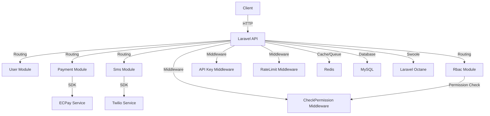

# ModuCore

> 企業級模組化後端框架，基於 Laravel 打造，專為高效能、可擴展的 API 系統設計，整合 RBAC、Octane、Docker 和 CI/CD。  
> ⭐ 歡迎 Fork 我們的 GitHub 倉庫：[https://github.com/BpsEason/ModuCore.git](https://github.com/BpsEason/ModuCore.git)

ModuCore 是一套模組化、高效能的 Laravel 後端框架，適合構建中大型 API 平台、SaaS 管理後台或多租戶系統，提供以下核心功能：

- ⚙️ **模組化架構**：可插拔模組（User、Payment、Sms、Rbac），支援自定義 `make:module` 指令快速生成模組骨架。
- 🔐 **RBAC 權限控管**：角色與權限分離，支援快取、API Key 驗證和速率限制，確保安全存取。
- 🚀 **高效能部署**：整合 Laravel Octane（Swoole）、Redis 快取/隊列，實現高吞吐量 API。
- 📦 **CI/CD 自動化**：透過 GitHub Actions 實現代碼檢查、測試、Docker 構建和部署。
- 📘 **完整 API 文件**：自動生成 Swagger/OpenAPI 文件，簡化開發與測試。

🧱 **適用情境**：
- 中大型企業 API 平台架構起始點。
- 需要模組化與 RBAC 控制的 Laravel 開發團隊。
- 快速搭建 SaaS 後台或多租戶系統的底層框架。

👉 快速開始、模組設計範例、部署指引詳見下方內容！

---

## 專案結構

專案位於 `ModuCore` 目錄，核心後端程式碼在 `backend-laravel` 子目錄。以下是主要結構：

```
ModuCore/
├── backend-laravel/              # Laravel 後端應用
│   ├── app/
│   │   ├── Console/Commands/     # 自定義 Artisan 命令（make:module）
│   │   ├── Core/Models/          # RBAC 模型（Role、Permission、UserRole）
│   │   ├── Http/Middleware/      # 中介層（API Key、權限檢查、速率限制）
│   │   ├── Modules/              # 模組化結構
│   │   │   ├── User/             # 使用者模組
│   │   │   ├── Payment/          # 金流模組（ECPay）
│   │   │   ├── Sms/              # 簡訊模組（Twilio）
│   │   │   └── Rbac/             # 角色權限管理模組
│   ├── config/                   # 配置檔案（modules.php、octane.php）
│   ├── database/                 # 資料庫遷移和填充
│   ├── tests/                    # 測試檔案
│   ├── .env.example              # 環境變數範例
│   ├── composer.json             # PHP 依賴配置
│   └── Dockerfile                # Laravel 後端 Docker 映像
├── docker/                       # Docker 配置（Nginx、Supervisor、Redis）
├── .github/workflows/            # CI/CD 配置（deploy.yml）
├── tests/                        # 壓力測試腳本（load_test.sh）
├── docker-compose.yml            # 本地環境 Docker Compose
└── docker-compose.prod.yml       # 生產環境 Docker Compose
```

### 架構圖
以下是 ModuCore 的模組化架構與服務互動示意圖，使用 Mermaid 繪製：



---

## 環境要求

- **Docker**：Docker Desktop 或 Docker Engine。
- **Docker Compose**：管理多容器服務。
- **Git**：版本控制與 CI/CD。
- **網際網路連線**：拉取 Docker 映像和 Composer 依賴。

---

## 安裝步驟

1. **克隆專案**：
   ```bash
   git clone https://github.com/BpsEason/ModuCore.git
   cd ModuCore
   ```

2. **配置環境變數**：
   複製並編輯 `.env`：
   ```bash
   cp backend-laravel/.env.example backend-laravel/.env
   ```
   設置關鍵變數：
   - `APP_KEY`：生成命令：
     ```bash
     docker-compose exec backend php artisan key:generate
     ```
   - `MODUCORE_API_KEY`：API 認證密鑰。
   - `ECPAY_*`：ECPay 金流憑證（`MERCHANT_ID`, `HASH_KEY`, `HASH_IV`）。
   - `TWILIO_*`：Twilio 簡訊憑證（`ACCOUNT_SID`, `AUTH_TOKEN`, `FROM_PHONE_NUMBER`）。
   - `DB_*`：資料庫配置（預設 MySQL）。
   - `REDIS_*`：Redis 配置（快取、會話、隊列）。

3. **建構並啟動 Docker 容器**：
   ```bash
   docker-compose up --build -d
   ```

4. **安裝 PHP 依賴**：
   ```bash
   docker-compose exec backend composer install --no-dev --optimize-autoloader
   ```

5. **執行資料庫遷移和填充**：
   ```bash
   docker-compose exec backend php artisan migrate --seed
   ```

6. **配置 Laravel Octane**：
   ```bash
   docker-compose exec backend php artisan octane:install --server=swoole
   ```

7. **生成 Swagger/OpenAPI 文件**：
   ```bash
   docker-compose exec backend php artisan vendor:publish --provider="L5Swagger\L5SwaggerServiceProvider"
   docker-compose exec backend php artisan l5-swagger:generate
   ```

8. **訪問應用程式**：
   - 後端服務：`http://localhost:8000`
   - Swagger API 文件：`http://localhost:8000/api/documentation`

---

## 使用方式

### API 端點
所有 API 端點均受保護，需提供：
- **API Key**：請求頭 `X-API-KEY`（設置於 `.env` 的 `MODUCORE_API_KEY`）。
- **Sanctum 認證**：部分端點需 Bearer Token（透過 `/api/auth/login` 獲取）。
- **權限檢查**：RBAC 控制存取（需分配角色/權限）。

主要模組端點：
- **User**：`/api/users`（CRUD 操作）
- **Payment**：`/api/payments`（ECPay 金流）
- **Sms**：`/api/sms/send`, `/api/sms/{externalId}/status`, `/api/sms/send-verification`（Twilio 簡訊）
- **Rbac**：`/api/rbac/roles`, `/api/rbac/permissions`（角色與權限管理）

詳細 API 文件：`http://localhost:8000/api/documentation`

### 生成新模組
使用自定義 Artisan 命令：
```bash
docker-compose exec backend php artisan make:module YourNewModule --all
```
生成模組位於 `backend-laravel/app/Modules/YourNewModule`，包含控制器、服務、模型、路由等。

### 壓力測試
執行壓力測試（需安裝 Apache Bench `ab`）：
```bash
cd tests
./load_test.sh
```

---

## 模組化設計範例

以下展示 ModuCore 的關鍵代碼，包含詳細註解，幫助開發者理解模組化實現。

### 1. 自定義 Artisan 命令：MakeModule.php
用於生成模組骨架，支援控制器、服務、模型等組件。

```php
<?php
namespace App\Console\Commands;

use Illuminate\Console\Command;
use Illuminate\Support\Str;

class MakeModule extends Command
{
    protected $signature = 'make:module {name} {--all} {--controller} {--service} {--model} {--routes} {--contract} {--provider} {--migration} {--config} {--test}';
    protected $description = 'Create a new module with specified components';

    public function handle()
    {
        $name = $this->argument('name');
        $modulePath = app_path('Modules/' . $name);

        // 檢查模組是否已存在，避免覆蓋
        if (is_dir($modulePath) && !$this->confirm("Module {$name} already exists. Overwrite?", false)) {
            $this->error("Module creation aborted.");
            return;
        }

        // 創建模組目錄結構
        $this->createModuleStructure($name);

        // 根據選項生成指定組件
        if ($this->option('all') || $this->option('controller')) $this->createController($name);
        if ($this->option('all') || $this->option('service')) $this->createService($name);
        if ($this->option('all') || $this->option('model')) $this->createModel($name);
        if ($this->option('all') || $this->option('routes')) $this->createRoutes($name);
        if ($this->option('all') || $this->option('contract')) $this->createContract($name);
        if ($this->option('all') || $this->option('provider')) $this->createProvider($name);
        if ($this->option('all') || $this->option('migration')) $this->createMigration($name);
        if ($this->option('all') || $this->option('config')) $this->createConfig($name);
        if ($this->option('all') || $this->option('test')) $this->createTest($name);

        $this->info("Module {$name} created successfully at {$modulePath}");
    }

    // 創建模組目錄結構（Controllers、Services、Models 等）
    protected function createModuleStructure($name)
    {
        $dirs = ['Controllers', 'Services', 'Contracts', 'Models', 'Providers', 'Config'];
        foreach ($dirs as $dir) {
            mkdir(app_path('Modules/' . $name . '/' . $dir), 0755, true);
        }
    }

    // 生成控制器，使用 stub 模板並替換命名空間和類名
    protected function createController($name)
    {
        $stub = file_get_contents(base_path('stubs/module.controller.stub'));
        $stub = str_replace(['{{module}}', '{{class}}'], [$name, Str::studly($name)], $stub);
        file_put_contents(app_path("Modules/{$name}/Controllers/{$name}Controller.php"), $stub);
    }

    // 生成服務類，實現業務邏輯
    protected function createService($name)
    {
        $stub = file_get_contents(base_path('stubs/module.service.stub'));
        $stub = str_replace(['{{module}}', '{{class}}'], [$name, Str::studly($name)], $stub);
        file_put_contents(app_path("Modules/{$name}/Services/{$name}Service.php"), $stub);
    }

    // 生成模型，包含基礎屬性和關係
    protected function createModel($name)
    {
        $stub = file_get_contents(base_path('stubs/module.model.stub'));
        $stub = str_replace(['{{module}}', '{{class}}'], [$name, Str::studly($name)], $stub);
        file_put_contents(app_path("Modules/{$name}/Models/{$name}.php"), $stub);
    }

    // 生成路由，定義模組 API 端點
    protected function createRoutes($name)
    {
        $stub = file_get_contents(base_path('stubs/module.routes.stub'));
        $stub = str_replace(['{{module}}', '{{class}}'], [$name, Str::studly($name)], $stub);
        file_put_contents(app_path("Modules/{$name}/routes.php"), $stub);
    }

    // 其他組件生成方法（合約、提供者、遷移、配置、測試）略...
}
```

**註解說明**：
- **目的**：提供 `make:module` 命令，允許開發者快速生成模組結構和組件。
- **功能**：支援生成控制器、服務、模型、路由等，通過 `--all` 或單獨選項（`--controller`, `--service` 等）靈活控制。
- **設計**：使用 stub 模板動態替換命名空間和類名，確保一致性；檢查模組是否存在，避免意外覆蓋。
- **使用**：執行 `php artisan make:module YourModule --all` 生成完整模組。

### 2. 簡訊模組控制器：SmsController.php
展示 Sms 模組的 API 處理邏輯。

```php
<?php
namespace App\Modules\Sms\Controllers;

use Illuminate\Http\Request;
use App\Http\Controllers\Controller;
use App\Modules\Sms\Services\SmsService;
use Illuminate\Support\Facades\Cache;

class SmsController extends Controller
{
    protected $smsService;

    // 依賴注入 SmsService，實現服務層解耦
    public function __construct(SmsService $smsService)
    {
        $this->smsService = $smsService;
    }

    // 發送簡訊 API，接受電話號碼和內容
    public function send(Request $request)
    {
        // 驗證請求數據，確保電話號碼和內容有效
        $validated = $request->validate([
            'phone_number' => 'required|string',
            'message' => 'required|string|max:160'
        ]);

        // 調用服務層發送簡訊
        $result = $this->smsService->send($validated['phone_number'], $validated['message']);

        // 返回成功或失敗響應
        return $result
            ? response()->json(['status' => 'success', 'message' => 'SMS sent', 'data' => $result])
            : response()->json(['status' => 'error', 'message' => 'SMS sending failed'], 500);
    }

    // 查詢簡訊狀態 API，根據外部 ID 查詢
    public function status(Request $request, string $externalId)
    {
        // 從快取查詢狀態，避免重複查詢
        $cacheKey = "sms_status_{$externalId}";
        $status = Cache::remember($cacheKey, 60, fn () => $this->smsService->getStatus($externalId));

        // 返回狀態或錯誤
        return $status
            ? response()->json(['status' => 'success', 'data' => $status])
            : response()->json(['status' => 'error', 'message' => 'SMS not found'], 404);
    }

    // 發送驗證碼簡訊 API
    public function sendVerification(Request $request)
    {
        // 驗證電話號碼
        $validated = $request->validate(['phone_number' => 'required|string']);

        // 生成驗證碼並發送
        $result = $this->smsService->sendVerification($validated['phone_number']);

        // 清除相關快取並返回結果
        Cache::forget("sms_verification_{$validated['phone_number']}");
        return $result
            ? response()->json(['status' => 'success', 'message' => 'Verification SMS sent'])
            : response()->json(['status' => 'error', 'message' => 'Failed to send verification SMS'], 500);
    }
}
```

**註解說明**：
- **目的**：處理簡訊相關 API 請求（發送、查詢狀態、驗證碼）。
- **功能**：實現發送簡訊（`/api/sms/send`）、查詢狀態（`/api/sms/{externalId}/status`）、發送驗證碼（`/api/sms/send-verification`）。
- **設計**：使用依賴注入（`SmsService`）分離業務邏輯；整合快取（Redis）優化狀態查詢；包含請求驗證和錯誤處理。
- **使用**：需搭配 `TwilioSmsService` 實現具體簡訊發送邏輯。

### 3. 簡訊服務：TwilioSmsService.php
實現 Twilio 簡訊發送邏輯。

```php
<?php
namespace App\Modules\Sms\Services;

use App\Modules\Sms\Contracts\SmsServiceContract;
use Twilio\Rest\Client;

class TwilioSmsService implements SmsServiceContract
{
    protected $client;

    // 初始化 Twilio 客戶端，讀取環境變數
    public function __construct()
    {
        $this->client = new Client(
            config('sms.twilio.sid'),
            config('sms.twilio.token')
        );
    }

    // 發送簡訊，實現合約中的 send 方法
    public function send(string $phoneNumber, string $message): array
    {
        try {
            // 使用 Twilio SDK 發送簡訊
            $response = $this->client->messages->create(
                $phoneNumber,
                [
                    'from' => config('sms.twilio.from'),
                    'body' => $message
                ]
            );

            // 返回簡訊發送結果
            return [
                'external_id' => $response->sid,
                'status' => $response->status
            ];
        } catch (\Exception $e) {
            // 記錄錯誤並返回 false
            \Log::error("SMS sending failed: {$e->getMessage()}");
            return [];
        }
    }

    // 查詢簡訊狀態，實現合約中的 getStatus 方法
    public function getStatus(string $externalId): array
    {
        try {
            // 查詢 Twilio 簡訊狀態
            $message = $this->client->messages($externalId)->fetch();
            return [
                'external_id' => $message->sid,
                'status' => $message->status,
                'error_code' => $message->errorCode,
                'error_message' => $message->errorMessage
            ];
        } catch (\Exception $e) {
            // 記錄錯誤並返回空陣列
            \Log::error("SMS status fetch failed: {$e->getMessage()}");
            return [];
        }
    }

    // 發送驗證碼，生成隨機碼並發送
    public function sendVerification(string $phoneNumber): bool
    {
        // 生成 6 位驗證碼
        $code = random_int(100000, 999999);

        // 儲存驗證碼到快取（5 分鐘有效）
        \Cache::put("sms_verification_{$phoneNumber}", $code, now()->addMinutes(5));

        // 發送驗證碼簡訊
        $result = $this->send($phoneNumber, "您的驗證碼是：{$code}");
        return !empty($result);
    }
}
```

**註解說明**：
- **目的**：實現簡訊發送邏輯，與 Twilio SDK 整合。
- **功能**：支援發送簡訊、查詢狀態、生成並發送驗證碼。
- **設計**：實現 `SmsServiceContract` 合約，確保可替換其他簡訊服務（如 Nexmo）；使用 Redis 快取儲存驗證碼；包含錯誤處理和日誌記錄。
- **使用**：需在 `.env` 配置 Twilio 憑證（`TWILIO_ACCOUNT_SID`, `TWILIO_AUTH_TOKEN`, `TWILIO_FROM_PHONE_NUMBER`）。

---

## 部署

### 本地部署
```bash
docker-compose up -d
```

### 生產部署
1. 配置 `docker-compose.prod.yml` 和 `.env`（設置 `APP_ENV=production`, `APP_DEBUG=false`）。
2. 部署：
   ```bash
   docker-compose -f docker-compose.prod.yml up -d
   ```
3. 執行遷移和優化：
   ```bash
   docker-compose -f docker-compose.prod.yml exec backend php artisan migrate --force
   docker-compose -f docker-compose.prod.yml exec backend php artisan optimize
   ```

### CI/CD
使用 GitHub Actions（`.github/workflows/deploy.yml`）：
- 代碼檢查、測試、Docker 構建、推送至容器倉庫、部署至伺服器。
- 配置 GitHub Secrets：`APP_KEY`, `DB_*`, `ECPAY_*`, `TWILIO_*`, `SSH_*`。

---

## 開發指引

### 新增模組
1. 生成模組：
   ```bash
   docker-compose exec backend php artisan make:module YourNewModule --all
   ```
2. 註冊服務提供者（`config/modules.php`）。
3. 更新遷移（`database/migrations`）和路由（`app/Modules/YourModule/routes.php`）。

### 自定義 RBAC
- 修改 `app/Core/Models/Role.php` 和 `Permission.php`。
- 使用 `CheckPermission` 中介層保護路由（例如 `CheckPermission::view-users`）。

### 金流與簡訊
- **ECPay**：實作 `app/Modules/Payment/Services/ECPayService.php`。
- **Twilio**：確保 Twilio SDK（`composer require twilio/sdk`）並實作 `TwilioSmsService.php`。

### 高效能優化
- 調整 `config/octane.php`（`workers`, `max_requests`）。
- 使用 Redis 快取（`CACHE_DRIVER=redis`）和隊列（`QUEUE_CONNECTION=redis`）。

---

## 問題排查

- **埠衝突**：
  ```bash
  ss -tuln | grep -E ':(8000|6379|3306)'
  ```
- **依賴安裝失敗**：
  ```bash
  docker-compose exec backend composer update
  ```
- **資料庫連線問題**：
  檢查 `.env` 的 `DB_*` 配置，確認 MySQL 運行：
  ```bash
  docker-compose ps
  ```

---

## 貢獻

歡迎 Fork 我們的倉庫並貢獻代碼！[https://github.com/BpsEason/ModuCore.git](https://github.com/BpsEason/ModuCore.git)
1. Fork 倉庫。
2. 創建分支：`git checkout -b feature/your-feature`。
3. 提交更改：`git commit -m "Add your feature"`。
4. 推送分支：`git push origin feature/your-feature`。
5. 提交 Pull Request。

---

## 授權
採用 MIT 授權，詳見 `LICENSE` 文件（請自行添加）。
